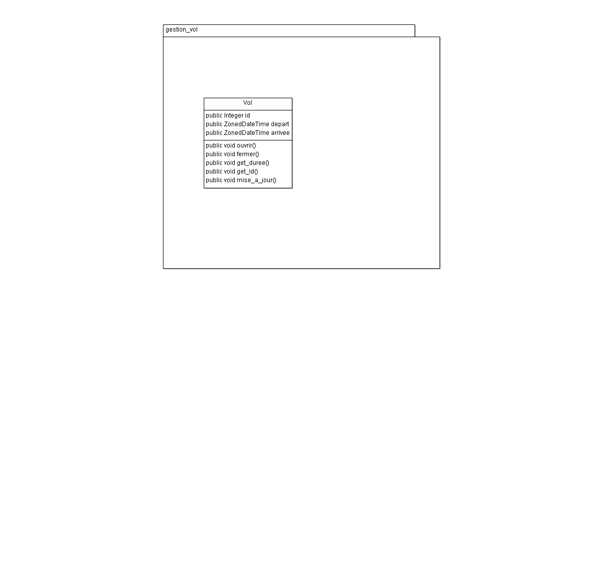

# TP_Vol

## Compiler

Se placer à la racine puis faire : `./gradlew build` puis `./gradlew run` 

## Avancement



## A faire

- [x] Implémentation les class et leurs constructeurs

- [x] Gérer les exceptions de dates 

- [x] Implémentation de la durée 

- [x] ID de vol unique 

- [x] Relier la compagnie au vol 

- [X] Relier l'aéroport au vol

- [x] Relier la ville aux aéroports 

- [ ] Gérer les escales (en cours)

- [ ] Package rservation 

- [ ] Relier Vol à Réservation

- [ ] Implémenter test unitaire

## Problèmes rencontrés

### Manipuler des dates

- Utilisation du type `ZonedDateTime`


### Gestion des exceptions sur la date 

Les exceptions sont gérer dans la méthode verif().

- [X] Date d'arrivée antérieure à celle de départ
- [X] Date d'arrivée égal à celle d'arrivée
- [x] Aeroport de départ est le même que celui d'arrivée
- [x] L'aeroport ne desert pas la ville entrée

Fonctionne mal car contenu d' `ArrayList ` : 
`[gestion_vol.Ville@6e8dacdf, gestion_vol.Ville@7a79be86]`

```java
public void verif(){
	if (this.date_arrivee.isBefore(this.date_depart)){
		throw new IllegalArgumentException("Arrival cannot be prior to departure");
	}
	if (this.date_depart.equals(this.date_arrivee)){
		throw new IllegalArgumentException("Arrival cannot be at the same time as departure");
	}
	if (this.depart.equals(this.arrivee)){
		throw new IllegalArgumentException("The place of arrival cannot be the same as the place of departure");
	}
	if(this.depart.dessert.contains(this.arrivee.get_ville())){
		throw new IllegalArgumentException("This airport does not serve the city entrance");
		}
	}
```

### Implémentation de la durée

Utilisation du type `duration` qui prend en argument les deux ZonedDateTime. 
Duration va renvoyer des caractères inutiles qui dont supprimer grâce à `replaceAll`.

```java
public String get_Duree(){ 
	String duree=Duration.between(this.depart, this.arrivee).toString();
	duree=(duree == null) ? null : duree.replaceAll("PT", "");
	duree=(duree == null) ? null : duree.replaceAll("H", ":");
	duree = (duree == null) ? null : duree.replaceAll("M", "");
	return duree;
}
```

### Vol unique 

Utilisation d'un seter qui incrémente un numéro de vol dans Compagnie. 

```java
public int get_id(){
	return this.idvol++;
}
```

### Agrégation compagnie - vol 

Nous avons décider d'implémenter une `ArrayList`.
La compagnie aura donc une liste de vol à sa disposition 
```java 
public class Compagnie{
	public String nom;
	private List<Vol> vols = new ArrayList<Vol>();
```

La compagnie va ensuite créer le vol.

Compagnie va utiliser des seters fonctionnant par couples implémenter dans Vol. verif() va vérifier si les données entrées sont bonnes tandis que print_all affiches toutes les données.
```java
public void creer_vol(Aeroport aeroport1, ZonedDateTime date1, Aeroport aeroport2, ZonedDateTime date2){
		Vol v = new Vol(this.nom,this.get_id());
		v.de(aeroport1, date1);
		v.vers(aeroport2, date2);
		this.vols.add(v);
		v.verif();
		v.print_all();
	}
``` 